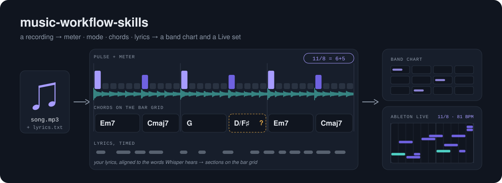

# music-workflow-skills

**Claude Code skills that turn a recording into a band chart and an Ableton Live set —
including the odd meters, modes and drones that other analysis tools flatten into 4/4
major/minor.**

Give Claude a song and its lyrics. It finds the pulse, sweeps for the meter, separates
stems, transcribes the bass, names the mode, reads the chords, times the lyrics, and writes
a chart a band can play from — then, if you want, rebuilds it in Live with the right time
signature. Everything runs offline on an Apple Silicon Mac, and every step is a script
with tests.

## The skills

| Skill | Use when |
|---|---|
| **`song-analysis`** | A recording has to become tempo, meter, key/mode, stems, bass line, chords per bar, timed lyrics, sections, or a band chart |
| `song-to-ableton` | You want a song rebuilt, covered or reinterpreted in Live — analysis feeding the build |
| `bass-transcribe` | You played bass (or sang a line) and want it as MIDI, a Live clip or a tab |
| `ableton-mcp` | Driving Live over MCP: tracks, clips, notes, devices, mixing, time signature — and the gotchas |
| `ableton-arrangement` | Arranging in Live: sections, bass and drum patterns in any meter, FX chains, dynamics |



## Why it's different

- **It finds meters it was never told about.** Instead of choosing between 3/4 and 4/4, it
  sweeps every cycle from 2 to 25 pulses on the drum, bass and harmonic stems. 7/8, 11/8
  and 5/4 come back with their grouping — 11/8 as 6+5, beat 1 counted from the kick.
- **It asks instead of guessing.** When the evidence can't decide — two equally strong
  accents, a 2-bar phrase that could be one bar, an eighth-note pulse that doubles the DAW
  tempo — it stops and tells Claude exactly what to ask you.
- **It measures modes.** Tonic from what the bass sustains, mode from bar-by-bar duels of
  the characteristic degrees (♯4 for Lydian, ♭7 for Mixolydian, ♭2 for Phrygian…). A degree
  that never sounds is reported as undetermined, not filled in.
- **It shows its uncertainty.** The chart says where the meter and mode came from and marks
  every chord cell where the two chord readers disagree, so your listening pass goes where
  it's needed.
- **It's benchmarked, failures included.** A local benchmark scores every step against
  player-verified answers; the docs record what didn't work, with numbers.

See [how it compares](docs/COMPARISON.md) with 75 other tools, skills and papers.

## What it looks like

<!-- screenshot: a generated chord+lyric chart, e.g. docs/img/chart.png -->

The meter sweep on a song in 11/8:

```text
CONSENSUS: 11 pulses per cycle (3/3 bands agree)
  downbeat: pulse 6 of the grid (kick band); grouping 5+6 (accents)
  AMBIGUOUS: the two strongest kick accents are within 10% - beat 1 may
    be pulse 0 instead, giving 6+5. Ask the user which hit is '1'.
  confidence HIGH: 5.4x clear of unrelated periods.
```

Claude asks which kick is "1" and whether the pulse is an eighth, then:

```text
11/8 as 6+5, 32 bars from 0.00s (0 pickup pulses); bar tempo 157.89-162.16 (drift 2.6%); Live tempo 81.08
```

And the mode of the same song, where a key detector said "G♯ minor":

```text
tonic E (57% of bass time) -> lydian
  third    wins  32 : 0   -> a
  4_vs_#4  wins   0 : 32  -> b
  7_vs_b7  wins  32 : 0   -> a
```

## Quick start

```bash
git clone https://github.com/PerIPan/music-workflow-skills.git
cd music-workflow-skills
for s in song-analysis ableton-mcp ableton-arrangement song-to-ableton bass-transcribe; do
  ln -sfn "$PWD/$s" ~/.claude/skills/$s
done
```

Set up the Python environments once —
[`song-analysis/references/environment-setup.md`](song-analysis/references/environment-setup.md)
has the exact, pinned commands. Restart Claude Code, put `song.mp3` and `lyrics.txt` in a
folder, and ask:

> Analyze song.mp3 and make a chord chart for my band. Lyrics are in lyrics.txt.

For the Live skills you also need the AbletonMCP server —
[`ableton-mcp/references/setup-install.md`](ableton-mcp/references/setup-install.md).

## The pipeline

| Phase | Script | Produces |
|---|---|---|
| 1 Pulse + key | `foundation.py pulse` | beat grid, tempo-octave check, key (top two) |
| 2 Stems | demucs `htdemucs_ft` | bass, drums, vocals, other |
| 3 Meter | `detect_meter.py` → `foundation.py meter` | cycle, grouping, downbeats, bar tempo, drift |
| 4 Bass, tonic, mode | `bass_notes.py` → `mode_test.py` | bass MIDI, tonic, mode (per section) |
| 5 Lyrics | `whisper_gated.py` | word timings (Whisper, gated by the vocal stem) |
| 6 Sections | `align_lyrics.py` | your lyrics with times, sections on the bar grid |
| 7 Chords | `lv_chords.py` + `chord_proposal.py` | chords with 7ths/inversions, cross-checked per cell |
| 8 Chart | (Claude writes it) | self-contained HTML chord+lyric chart |

`validate_artifacts.py` checks the hand-offs between phases;
`ableton-mcp/scripts/push_notes.py` pushes notes into Live over its TCP socket.

## Measured

On a local benchmark of player-verified songs and public lyric data (small samples —
details in [COMPARISON.md](docs/COMPARISON.md#measured-numbers-local-benchmark)):

- meter consistent with the true bar on 3 of 4 songs, none wrong (1 inconclusive)
- a verified Lydian drone named E Lydian, ♯4 in 32 of 32 bars
- chords 73–96% major/minor agreement per song
- lyrics 17.9% word error; 83% of line starts within 1 s; 98% of sections within 2 s

Run it yourself with `song-analysis/bench/run_bench.py` against your own verified songs
(truth files stay on your machine).

## Requirements

- Apple Silicon Mac (tested on a base M3, 16 GB); CUDA works for stems
- [uv](https://docs.astral.sh/uv/) and ffmpeg
- Python 3.12 virtualenvs on current releases — NumPy 2.5, librosa 1.0, madmom (latest),
  TensorFlow 2.21, demucs 4.1, torch 2.14, lv-chordia 1.1, mlx-whisper 0.4 — about 2 GB of
  models; exact pins in the environment reference
- For the Live skills: Ableton Live 11/12 and the AbletonMCP Remote Script

## Tests

Offline, on synthetic audio or a mock Live socket — 40 checks:

```bash
<analysis-venv>/bin/python song-analysis/tests/test_detect_meter.py
<analysis-venv>/bin/python song-analysis/tests/test_chord_proposal.py
<analysis-venv>/bin/python song-analysis/tests/test_mode_test.py
python3 song-analysis/tests/test_foundation.py
python3 song-analysis/tests/test_align_lyrics.py
python3 ableton-mcp/tests/test_push_notes.py
```

## Layout

Each skill is a `SKILL.md` (when to use it, the method, the traps) plus `references/`
loaded on demand, `scripts/` it runs and `tests/` for those scripts. Machine-specific paths
live in one "This machine" section of the environment reference.

## Licence

MIT — see [LICENSE](LICENSE). The tools the skills call keep their own licences — several
models (madmom's, ADTOF, some separators) are non-commercial; they are installed, never
copied into this repo.
